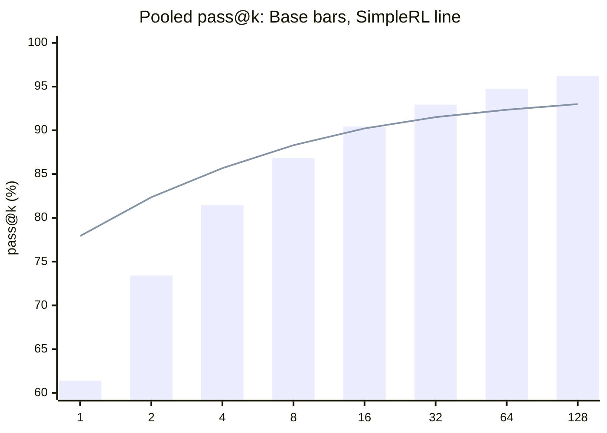
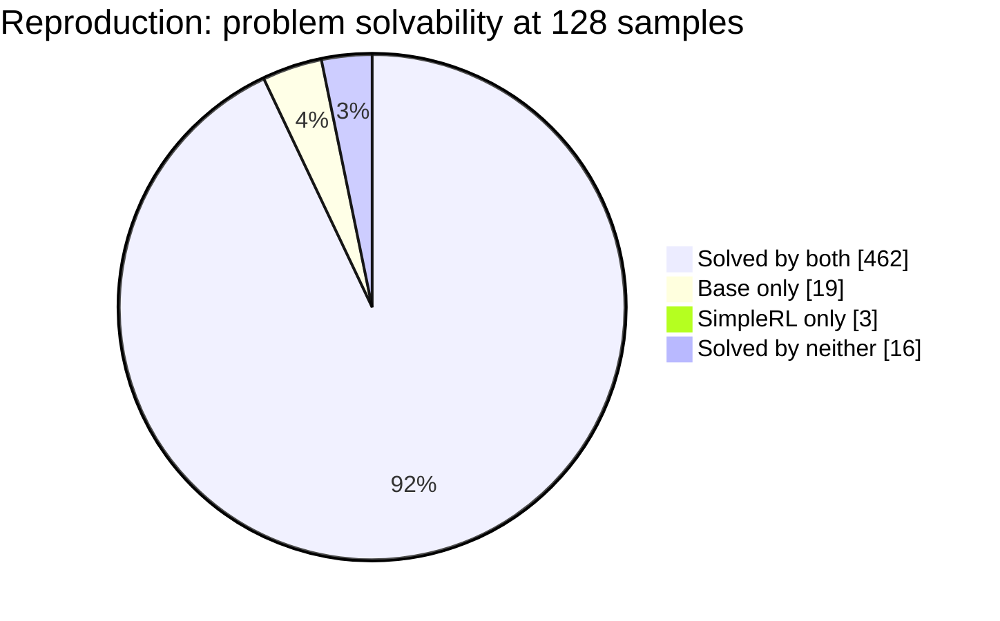

# Report: Qwen2.5-7B × MATH500 Reproduction

[中文版](EXPERIMENT_REPORT.zh-CN.md) · [Repository home](../README.md) · [Machine-readable results](../audit/results.json)

**Study:** Reproduction of Figure 2 and Table 2 in *Limit of Reinforcement Learning with Verifiable Rewards* ([arXiv:2504.13837 v5](https://arxiv.org/abs/2504.13837)) 
**Evaluation completed:** August 14, 2026 (UTC) 
**Scope:** Public-checkpoint evaluation only; no GRPO retraining

## 1. Executive summary

### Research question

When reinforcement learning with verifiable rewards (RLVR) raises single-sample mathematical accuracy, does it also preserve the breadth of problems that the base model can solve when many independent attempts are allowed?

### Main finding

SimpleRL substantially improves low-budget accuracy: pooled pass@1 rises from **61.39% to 77.93%** (**+16.54 percentage points**). The advantage shrinks as the sampling budget grows, crosses between pass@8 and pass@16, and reverses at high budgets. At pass@128, Base reaches **96.20%**, while SimpleRL reaches **93.00%** (**−3.20 points** for SimpleRL).

This reversal is supported by a problem-paired analysis. At pass@128, Base uniquely solves 19 problems and SimpleRL uniquely solves 3; the remaining 478 problems are ties. The SimpleRL-minus-Base difference has a paired bootstrap 95% confidence interval of **[−5.00, −1.40] percentage points**.

The result reproduces the paper's central qualitative claim: **RLVR can improve the probability of producing a correct answer on already accessible problems while reducing the long-tail coverage revealed by large sampling budgets.** This means pass@1 and high-budget pass@k answer different scientific questions and should be reported together.

## 2. Experimental design

The experiment evaluates the paper authors' public Base and SimpleRL checkpoints under one shared, fixed evaluation configuration. It does not reproduce the GRPO training stage.

| Component | Audited value |
|---|---|
| Paper target | arXiv:2504.13837 v5, Figure 2 / Table 2 |
| Official code | `LeapLabTHU/limit-of-RLVR@79c348f4543330bb78b01a5332df09fea2700f70` |
| Base model | `Qwen/Qwen2.5-7B@d149729398750b98c0af14eb82c78cfe92750796` |
| RLVR model | `hkust-nlp/Qwen-2.5-7B-SimpleRL-Zoo@d630142f26acc8adf8051298cba8023232169d56` |
| Dataset | Repository MATH500, 500 problems |
| Dataset SHA-256 | `35dc41080a3680858b27fa7e0533d2d547825316fc5dafe5d316f4ccc5a06132` |
| Prompt | Official zero-shot `qwen-boxed`; no additional chat template |
| Sampling | temperature 0.6; top-p 0.95; seeds 1–4 |
| Samples | 32 per problem per seed; 128 per problem after pooling |
| Length limits | maximum generation 16,384; maximum model length 32,768 |
| vLLM | tensor parallelism 1; GPU memory utilization 0.9; default dtype |
| Runtime | Python 3.10.20; PyTorch 2.4.0+cu124; vLLM 0.6.3; RTX 3090 24 GiB |
| Execution order | Base seeds 1–4, followed by SimpleRL seeds 1–4 |

There are eight result files in total. Each contains 500 problems × 32 generations, giving **64,000 responses per model and 128,000 responses overall**. For each problem with (n) observed samples and (c) correct samples, the unbiased estimator is

\[
\operatorname{pass@k}=1-\frac{\binom{n-c}{k}}{\binom{n}{k}}.
\]

For pooled pass@128, (n=128) is formed from the actual samples across all four seeds; it is not extrapolated from a single seed's pass@32.

## 3. Main results

| Model | pass@1 | pass@2 | pass@4 | pass@8 | pass@16 | pass@32 | pass@64 | pass@128 |
|---|---:|---:|---:|---:|---:|---:|---:|---:|
| Qwen2.5-7B Base | 61.39% | 73.41% | 81.44% | 86.82% | **90.43%** | **92.93%** | **94.74%** | **96.20%** |
| Qwen2.5-7B SimpleRL | **77.93%** | **82.36%** | **85.68%** | **88.30%** | 90.22% | 91.51% | 92.35% | 93.00% |
| SimpleRL − Base | +16.54 | +8.95 | +4.24 | +1.48 | −0.21 | −1.42 | −2.39 | −3.20 |

The following chart uses **bars for Base** and a **line for SimpleRL**. It is rendered directly from Markdown with [GitHub Mermaid support](https://docs.github.com/en/get-started/writing-on-github/working-with-advanced-formatting/creating-diagrams), so no external image asset is required. The table remains the authoritative source for exact values.

SimpleRL produces **49,877 correct generations out of 64,000**, versus **39,291** for Base, which explains the large pass@1 gain. However, at least one correct answer is observed for **481/500 Base problems** and **465/500 SimpleRL problems**. The experiment therefore separates two effects:

- **Probability concentration:** SimpleRL assigns more sampling probability to correct trajectories on many solvable problems.
- **Coverage:** Base retains non-zero observed success on 16 more problems at a 128-sample budget.

The data establish this probability–coverage trade-off under the audited evaluation. They do not, by themselves, prove that training permanently erased a capability; changes in probability mass, reasoning diversity, output format, or extremely low-probability solutions can produce the same observed pattern.

## 4. Comparison with the paper

### pass@128

| Model | Paper | Reproduction | Reproduction − paper |
|---|---:|---:|---:|
| Base | 96.0% | 96.2% | +0.2 points |
| SimpleRL | 93.4% | 93.0% | −0.4 points |
| SimpleRL − Base | −2.6 points | −3.2 points | −0.6 points |

### Problem-level solvability at 128 samples

| Category | Paper | Reproduction | Difference |
|---|---:|---:|---:|
| Solved by both | 462 | 462 | 0 |
| Base only | 18 | 19 | +1 |
| SimpleRL only | 5 | 3 | −2 |
| Solved by neither | 15 | 16 | +1 |

The reproduction is numerically close to the paper and exactly matches its largest category (462 problems solved by both). Small count differences are expected from stochastic decoding. No seed was selected, discarded, or rerun because its numerical result disagreed with the paper. Consequently, this work supports **configuration and code fidelity**, while treating exact stochastic equality as neither expected nor required.

## 5. Statistical evidence and seed stability

### Paired pass@128 result

| Statistic | Result |
|---|---:|
| SimpleRL wins | 3 problems |
| Base wins | 19 problems |
| Ties | 478 problems |
| SimpleRL − Base | −3.20 percentage points |
| Problem-paired bootstrap 95% CI | [−5.00, −1.40] points |

Because the confidence interval excludes zero, the observed high-budget disadvantage is not explained by a few arbitrary unpaired aggregate fluctuations. The unit resampled by the bootstrap is the MATH500 problem, preserving the paired Base/SimpleRL comparison.

### Per-seed pass@k

Each seed contains 32 samples per problem, so the highest directly observable value per seed is pass@32.

| Model | Seed | pass@1 | pass@8 | pass@16 | pass@32 |
|---|---:|---:|---:|---:|---:|
| Base | 1 | 61.38% | 87.06% | 90.97% | 94.00% |
| Base | 2 | 61.44% | 86.30% | 89.51% | 91.60% |
| Base | 3 | 61.23% | 86.76% | 90.50% | 93.20% |
| Base | 4 | 61.52% | 87.08% | 90.71% | 93.00% |
| SimpleRL | 1 | 77.95% | 88.54% | 90.41% | 91.40% |
| SimpleRL | 2 | 78.00% | 88.01% | 90.03% | 91.60% |
| SimpleRL | 3 | 77.66% | 88.13% | 90.15% | 91.40% |
| SimpleRL | 4 | 78.12% | 88.65% | 90.41% | 91.40% |

The low-budget direction is highly stable: SimpleRL leads pass@1 by roughly 16.4–16.6 points and pass@8 by 1.4–1.7 points in every seed. Around the crossover, pass@16 is mixed: Base leads in three seeds, while SimpleRL leads in seed 2. At pass@32, Base leads in three seeds and ties in seed 2. The large-budget conclusion therefore comes from pooling the complete 128-sample record and pairing problems, rather than claiming that every finite seed must have the same sign at the crossover.

## 6. Integrity, limitations, and interpretation

### Integrity checks

- All eight JSONL files contain exactly 500 unique problem indices.
- Every problem has 32 generations, predictions, scores, and finish reasons.
- All generation, score, and finish-reason entries are non-null.
- Base has six empty generations and six corresponding `pred=None` parse failures; these observed samples are retained and scored as incorrect.
- SimpleRL has no empty generations and one response terminated by the length limit.
- No original output was overwritten or selectively regenerated during the final audit.

### Limitations

1. **Checkpoint rather than training reproduction.** The study isolates the evaluation claim but does not independently reproduce GRPO optimization.
2. **Stochastic decoding.** Immutable code and settings do not imply bitwise-identical sampled outputs; paper agreement should be assessed at the conclusion and uncertainty levels.
3. **Environment drift.** Core versions are pinned and recorded, but historically unpinned transitive dependencies cannot establish the authors' exact environment retrospectively.
4. **Observed support.** “Solved at 128” means at least one success was observed in 128 attempts. It is not proof that the model has mathematically zero probability of solving an unsolved problem.
5. **Single benchmark and model pair.** The trade-off should be tested across domains, training recipes, model sizes, and decoding regimes before being generalized.

### Implications for subsequent work

- Report both low-budget accuracy and high-budget coverage; pass@1 alone can hide a narrower solution support.
- Study the 19 Base-only and 3 SimpleRL-only problems for differences in topic, difficulty, proof strategy, and formatting sensitivity.
- Quantify reasoning diversity directly, rather than inferring diversity only from pass@k.
- Track when the coverage gap emerges during training to distinguish reward-driven probability concentration from checkpoint-specific noise.
- Test whether entropy control, data mixtures, or explicit diversity objectives retain the pass@1 gain without losing long-tail coverage.

## 7. Reproducibility record

- [Full execution protocol and recovery log](../PROTOCOL.md)
- [Machine-readable pooled and per-problem audit](../audit/results.json)
- [Pass@k curve in CSV format](../audit/pass_at_k_curve.csv)
- [Captured software and hardware environment](../environment/README.md)
- [SHA-256 manifest for the eight raw result files](../manifests/raw-results.sha256)
- [Independent audit implementation](../scripts/audit_all.py)
- [Concise audit summary](REPORT.md)

## Conclusion

Under a faithful public-checkpoint reproduction, SimpleRL is decisively better when only a few samples are available, but Base solves a broader set of MATH500 problems when the budget reaches 128 attempts. The reproduction closely matches the original paper and strengthens the practical recommendation that RLVR systems should be evaluated on both **per-sample correctness** and **problem-set coverage under scaling**.

---

[中文版](EXPERIMENT_REPORT.zh-CN.md) · [Repository home](../README.md) · [Machine-readable results](../audit/results.json)
