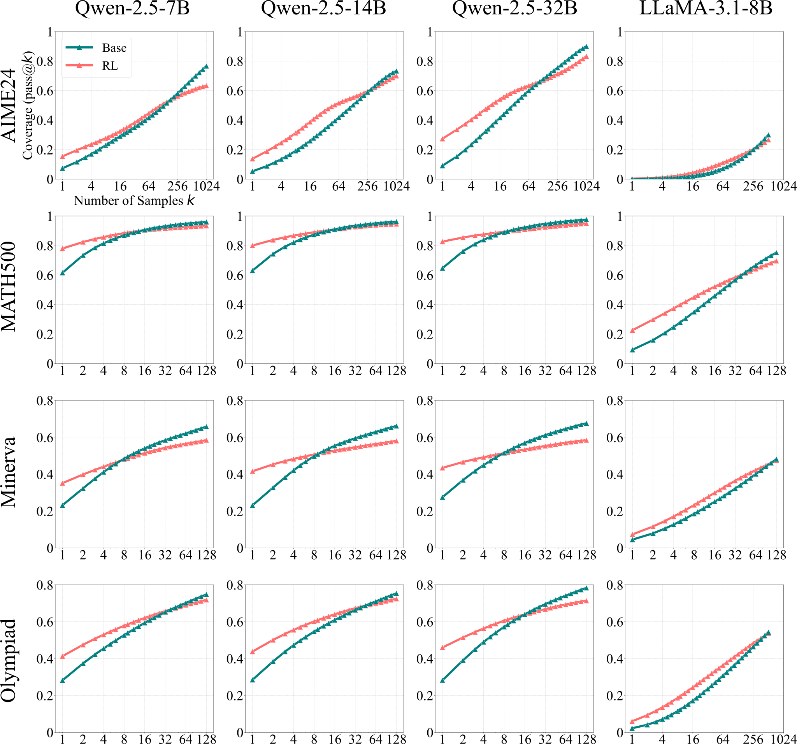
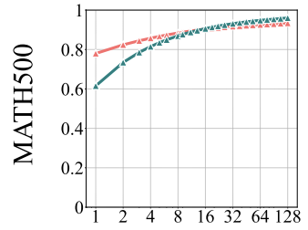
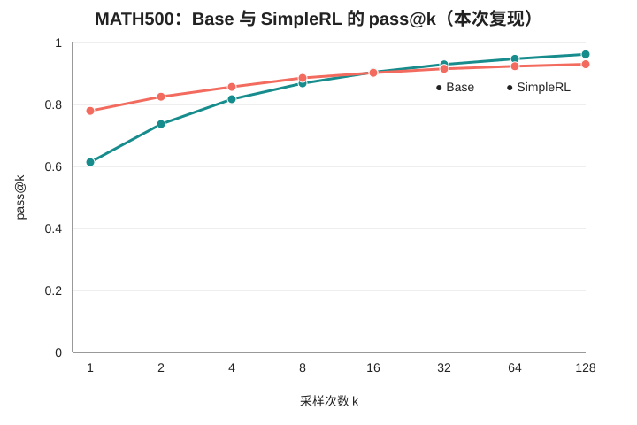

# Qwen2.5-7B × MATH500 严格复现实验报告

[English Version](EXPERIMENT_REPORT.en.md) · [仓库首页](../README.md) · [结果](../audit/results.json)

**实验对象：** 复现论文 *Limit of Reinforcement Learning with Verifiable Rewards*（[arXiv:2504.13837 v5](https://arxiv.org/pdf/2504.13837)）Figure 2 / Table 2 
**复现范围：** 仅评测公开 checkpoint，不重新训练 GRPO

## 1. 摘要

### 研究问题

当可验证奖励强化学习（RLVR）提高模型的单次数学回答准确率后，它是否仍能保留基础模型在多次独立尝试下可解题目的广度？

### 核心结论

SimpleRL 显著提高了低采样预算下的准确率：pooled pass@1 从 **61.39% 提升到 77.93%**，增加 **16.54 个百分点**。但随着采样预算提高，这一优势持续缩小，在 pass@8 与 pass@16 之间发生反转。到 pass@128，Base 达到 **96.20%**，SimpleRL 为 **93.00%**，SimpleRL 相对 Base 低 **3.20 个百分点**。

逐题配对分析支持这一反转：在 pass@128 下，Base 独有 19 道可解题，SimpleRL 独有 3 道，其余 478 道持平。SimpleRL − Base 的逐题 bootstrap 95% 置信区间为 **[−5.00, −1.40] 个百分点**。

该结果复现了原论文的核心定性结论：**RLVR 可能提高模型在原本可解问题上采样到正确答案的概率，但也可能使采样分布更加集中，降低大规模采样对长尾问题或少见解法的探索覆盖。** 

## 2. 实验设计

本实验在完全共享的固定评测配置下，对论文作者公开的 Base 与 SimpleRL checkpoint 进行评测，不覆盖 GRPO 训练阶段。

| 项目 | 固定设置 |
|---|---|
| 目标论文 | arXiv:2504.13837 v5，Figure 2 / Table 2 |
| 官方代码 | [LeapLabTHU/limit-of-RLVR](https://github.com/LeapLabTHU/limit-of-RLVR) |
| Base 模型 | [Qwen/Qwen2.5-7B@d149729](https://huggingface.co/Qwen/Qwen2.5-7B/commit/d149729398750b98c0af14eb82c78cfe92750796) |
| RLVR 模型 | [Qwen-2.5-7B-SimpleRL-Zoo@d630142](https://huggingface.co/hkust-nlp/Qwen-2.5-7B-SimpleRL-Zoo/commit/d630142f26acc8adf8051298cba8023232169d56) |
| 数据集 | 仓库内 MATH500，共 500 题 |
| 数据集 SHA-256 | `35dc41080a3680858b27fa7e0533d2d547825316fc5dafe5d316f4ccc5a06132` |
| Prompt | 官方零样本 `qwen-boxed`，不额外应用 chat template |
| 采样参数 | temperature 0.6；top-p 0.95；seeds 1–4 |
| 采样次数 | 每个 seed 每题 32 次；四个 seed 合并后每题 128 次 |
| 长度设置 | 最大生成长度 16,384；最大模型长度 32,768 |
| vLLM | tensor parallelism 1；GPU memory utilization 0.9；默认 dtype |
| 运行环境 | Python 3.10.20；PyTorch 2.4.0+cu124；vLLM 0.6.3；RTX 3090 24 GiB |
| 执行顺序 | Base seeds 1–4，随后 SimpleRL seeds 1–4 |

实验共生成 8 个结果文件。每个文件包含 500 题 × 每题 32 个回答，即**每个模型 64,000 个回答，总计 128,000 个回答**。对于某题的 (n) 个实际样本和其中 (c) 个正确样本，采用无偏估计量

## 3. 主要结果

| 模型 | pass@1 | pass@2 | pass@4 | pass@8 | pass@16 | pass@32 | pass@64 | pass@128 |
|---|---:|---:|---:|---:|---:|---:|---:|---:|
| Qwen2.5-7B Base | 61.39% | 73.41% | 81.44% | 86.82% | **90.43%** | **92.93%** | **94.74%** | **96.20%** |
| Qwen2.5-7B SimpleRL | **77.93%** | **82.36%** | **85.68%** | **88.30%** | 90.22% | 91.51% | 92.35% | 93.00% |
| SimpleRL − Base | +16.54 | +8.95 | +4.24 | +1.48 | −0.21 | −1.42 | −2.39 | −3.20 |

**原论文 Figure 2（MATH500 子图）：**

<table width="100%">
<tr>
<td align="center" width="50%"><strong>Figure 2（MATH500 子图）</strong></td>
<td align="center" width="50%"><strong>本次复现实验</strong></td>
</tr>
<tr>
<td align="center" width="50%"></td>
<td align="center" width="50%"></td>
</tr>
</table>

SimpleRL 在 64,000 个样本中产生 **49,877 个正确回答**，Base 为 **39,291 个**，这解释了显著的 pass@1 增益。然而，在 128 次尝试中至少出现过一次正确答案的题目数，Base 为 **481/500**，SimpleRL 为 **465/500**。

## 4. 与原论文结果对照

### pass@128

| 模型 | 原论文 | 本次复现 | 复现 − 论文 |
|---|---:|---:|---:|
| Base | 96.0% | 96.2% | +0.2 个百分点 |
| SimpleRL | 93.4% | 93.0% | −0.4 个百分点 |
| SimpleRL − Base | −2.6 个百分点 | −3.2 个百分点 | −0.6 个百分点 |

### 128 次采样下的逐题可解集合

| 类别 | 原论文 | 本次复现 | 差异 |
|---|---:|---:|---:|
| 双方可解 | 462 | 462 | 0 |
| 仅 Base 可解 | 18 | 19 | +1 |
| 仅 SimpleRL 可解 | 5 | 3 | −2 |
| 双方均不可解 | 15 | 16 | +1 |

本次结果在数值上与原论文接近，并且最大类别“双方可解”完全一致，均为 462 题。其余少量题目数量差异符合预期。

## 5. 统计证据与 seed 稳定性

### pass@128 逐题配对结果

| 统计量 | 结果 |
|---|---:|
| SimpleRL 胜 | 3 题 |
| Base 胜 | 19 题 |
| 平局 | 478 题 |
| SimpleRL − Base | −3.20 个百分点 |
| 逐题 bootstrap 95% CI | [−5.00, −1.40] 个百分点 |

置信区间不包含 0，说明高预算劣势并非仅由少数未配对的总体波动造成。Bootstrap 的重采样单位是 MATH500 题目，从而保留每道题上的 Base/SimpleRL 配对关系。

### 各 seed 的 pass@k

每个 seed 每题只有 32 个样本，因此单个 seed 能直接观测的最高预算是 pass@32。

| 模型 | Seed | pass@1 | pass@8 | pass@16 | pass@32 |
|---|---:|---:|---:|---:|---:|
| Base | 1 | 61.38% | 87.06% | 90.97% | 94.00% |
| Base | 2 | 61.44% | 86.30% | 89.51% | 91.60% |
| Base | 3 | 61.23% | 86.76% | 90.50% | 93.20% |
| Base | 4 | 61.52% | 87.08% | 90.71% | 93.00% |
| SimpleRL | 1 | 77.95% | 88.54% | 90.41% | 91.40% |
| SimpleRL | 2 | 78.00% | 88.01% | 90.03% | 91.60% |
| SimpleRL | 3 | 77.66% | 88.13% | 90.15% | 91.40% |
| SimpleRL | 4 | 78.12% | 88.65% | 90.41% | 91.40% |

低预算方向非常稳定：四个 seed 中，SimpleRL 的 pass@1 均领先约 16.4–16.6 个百分点，pass@8 均领先约 1.4–1.7 个百分点。在反转附近，pass@16 的方向存在混合：Base 在三个 seed 中领先，SimpleRL 在 seed 2 中领先。pass@32 下，Base 在三个 seed 中领先，在 seed 2 中持平。因此，高预算结论来自完整 128 个实际样本的合并与逐题配对，而不是要求每个有限 seed 在反转点附近都具有完全相同的符号。

## 6. 数据完整性检查

- 8 个 JSONL 均包含完整且唯一的 500 个题目索引。
- 每题均有 32 个 generation、prediction、score 和 finish reason。
- generation、score 和 finish reason 均不存在空缺值。
- Base 有 6 个空生成及对应的 6 个 `pred=None` 解析失败；这些实际观测样本被保留并计为错误。
- SimpleRL 没有空生成，有 1 个回答因达到长度上限结束。
- 最终审计没有覆盖原始输出，也没有选择性重新生成任何结果。

## 7. 可复现性与审计链接

- [完整执行协议与恢复记录](../PROTOCOL.md)
- [机器可读的 pooled 与逐题审计结果](../audit/results.json)
- [CSV 格式的 pass@k 曲线](../audit/pass_at_k_curve.csv)
- [软件与硬件环境记录](../environment/README.md)
- [8 个原始结果文件的 SHA-256 清单](../manifests/raw-results.sha256)
- [独立审计实现](../scripts/audit_all.py)
- [简版审计摘要](REPORT.md)

## 结论

在严格对齐公开 checkpoint 的复现实验中，SimpleRL 在少量采样时明显更强，但当预算增加到每题 128 次尝试时，Base 能覆盖更广的 MATH500 题目集合。本次结果与原论文高度接近。
